# Draft review

No Azure deployment has been performed. The target below is the draft tool's configured default; the ARM template lets you choose the destination during deployment. The tool's deployability check is structural, not proof that permissions or storage are configured.

## 1. DEPLOYMENT REVIEW
- Draft ID: DeviceCodeResilience-DeviceMonitor_20261006T125959Z
- Draft name: DeviceCodeResilience-DeviceMonitor
- Source: {'type': 'generated'}
- Target resource group: WizardCyberSOC
- Target Logic App name: DeviceCodeResilience-DeviceMonitor
- Mode: CREATE
- Existing Logic App found: no
- Location: uksouth
- Validation: 0 error(s), 0 warning(s), 7 info
  Issues:
  - [INFO] terminal_action: Action has no outgoing edge (may be a terminal step): Process_all_pages.Process_page.For_each_device.If_unseen_device.If_live_monitoring.Check_detection_result.Detection_saved | node: Process_all_pages.Process_page.For_each_device.If_unseen_device.If_live_monitoring.Check_detection_result.Detection_saved
  - [INFO] terminal_action: Action has no outgoing edge (may be a terminal step): Process_all_pages.Process_page.For_each_device.If_unseen_device.If_live_monitoring.Check_detection_result.else.Mark_detection_failure | node: Process_all_pages.Process_page.For_each_device.If_unseen_device.If_live_monitoring.Check_detection_result.else.Mark_detection_failure
  - [INFO] terminal_action: Action has no outgoing edge (may be a terminal step): Process_all_pages.Process_page.For_each_device.If_unseen_device.Remember_after_success.Remember_device | node: Process_all_pages.Process_page.For_each_device.If_unseen_device.Remember_after_success.Remember_device
  - [INFO] terminal_action: Action has no outgoing edge (may be a terminal step): Process_all_pages.Process_page.Set_delta_link | node: Process_all_pages.Process_page.Set_delta_link
  - [INFO] terminal_action: Action has no outgoing edge (may be a terminal step): Process_all_pages.Stop_on_page_failure | node: Process_all_pages.Stop_on_page_failure
  - [INFO] terminal_action: Action has no outgoing edge (may be a terminal step): Commit_only_complete_round.Save_checkpoint | node: Commit_only_complete_round.Save_checkpoint
  - [INFO] terminal_action: Action has no outgoing edge (may be a terminal step): Commit_only_complete_round.else.Fail_without_checkpoint | node: Commit_only_complete_round.else.Fail_without_checkpoint
- Connectors required:
  - (none)
- Approval phrase: DEPLOY WizardCyberSOC DeviceCodeResilience-DeviceMonitor
- Deployable now: yes

## 2. LOGIC SUMMARY
Triggers: 1
Actions (top-level): 9
Parameters: 3

Triggers:
- Every_minute [Recurrence]

Actions:
- Read_checkpoint [Http]
- Validate_checkpoint [ParseJson]
- Process_all_pages [Until]
  - Process_page [Scope]
    - Get_device_delta [Http]
    - Validate_page [ParseJson]
    - For_each_device [Foreach]
      - If_unseen_device [If]
        - If_live_monitoring [If]
          - Write_detection [Http]
          - Check_detection_result [If]
            - Detection_saved [Compose]
            Else:
              - Mark_detection_failure [SetVariable]
        - Remember_after_success [If]
          - Remember_device [AppendToArrayVariable]
    - Set_next_link [SetVariable]
    - Set_delta_link [SetVariable]
  - Stop_on_page_failure [SetVariable]
- Commit_only_complete_round [If]
  - Save_checkpoint [Http]
  Else:
    - Fail_without_checkpoint [Terminate]
- Initialize_knownDeviceIds [InitializeVariable]
- Initialize_baseline [InitializeVariable]
- Initialize_nextLink [InitializeVariable]
- Initialize_deltaLink [InitializeVariable]
- Initialize_processingFailed [InitializeVariable]

Connectors referenced:
- (none)

## 3. DIAGRAM (Mermaid)

```mermaid
flowchart TD
  N_trigger_Every_minute["Every_minute<br/>Trigger / Recurrence"]
  N_Read_checkpoint["Read_checkpoint<br/>Http"]
  N_Validate_checkpoint["Validate_checkpoint<br/>ParseJson"]
  N_Process_all_pages["Process_all_pages<br/>Until"]
  N_Process_all_pages_Process_page["Process_page<br/>Scope"]
  N_Process_all_pages_Process_page_Get_device_delta["Get_device_delta<br/>Http"]
  N_Process_all_pages_Process_page_Validate_page["Validate_page<br/>ParseJson"]
  N_Process_all_pages_Process_page_For_each_device["For_each_device<br/>Foreach"]
  N_Process_all_pages_Process_page_For_each_device_If_unseen_device["If_unseen_device<br/>If"]
  N_Process_all_pages_Process_page_For_each_device_If_unseen_device_If_live_monitoring["If_live_monitoring<br/>If"]
  N_Process_all_pages_Process_page_For_each_device_If_unseen_device_If_live_monitoring_Write_detection["Write_detection<br/>Http"]
  N_Process_all_pages_Process_page_For_each_device_If_unseen_device_If_live_monitoring_Check_detection_result["Check_detection_result<br/>If"]
  N_Process_all_pages_Process_page_For_each_device_If_unseen_device_If_live_monitoring_Check_detection_result_Detection_saved["Detection_saved<br/>Compose"]
  N_Process_all_pages_Process_page_For_each_device_If_unseen_device_If_live_monitoring_Check_detection_result_else_Mark_detection_failure["Mark_detection_failure<br/>SetVariable"]
  N_Process_all_pages_Process_page_For_each_device_If_unseen_device_Remember_after_success["Remember_after_success<br/>If"]
  N_Process_all_pages_Process_page_For_each_device_If_unseen_device_Remember_after_success_Remember_device["Remember_device<br/>AppendToArrayVariable"]
  N_Process_all_pages_Process_page_Set_next_link["Set_next_link<br/>SetVariable"]
  N_Process_all_pages_Process_page_Set_delta_link["Set_delta_link<br/>SetVariable"]
  N_Process_all_pages_Stop_on_page_failure["Stop_on_page_failure<br/>SetVariable"]
  N_Commit_only_complete_round["Commit_only_complete_round<br/>If"]
  N_Commit_only_complete_round_Save_checkpoint["Save_checkpoint<br/>Http"]
  N_Commit_only_complete_round_else_Fail_without_checkpoint["Fail_without_checkpoint<br/>Terminate"]
  N_Initialize_knownDeviceIds["Initialize_knownDeviceIds<br/>InitializeVariable"]
  N_Initialize_baseline["Initialize_baseline<br/>InitializeVariable"]
  N_Initialize_nextLink["Initialize_nextLink<br/>InitializeVariable"]
  N_Initialize_deltaLink["Initialize_deltaLink<br/>InitializeVariable"]
  N_Initialize_processingFailed["Initialize_processingFailed<br/>InitializeVariable"]
  N_trigger_Every_minute -->|"start"| N_Read_checkpoint
  N_Read_checkpoint -->|"Succeeded"| N_Validate_checkpoint
  N_Initialize_processingFailed -->|"Succeeded"| N_Process_all_pages
  N_Process_all_pages -->|"Contains"| N_Process_all_pages_Process_page
  N_Process_all_pages_Process_page -->|"Scope"| N_Process_all_pages_Process_page_Get_device_delta
  N_Process_all_pages_Process_page_Get_device_delta -->|"Succeeded"| N_Process_all_pages_Process_page_Validate_page
  N_Process_all_pages_Process_page_Validate_page -->|"Succeeded"| N_Process_all_pages_Process_page_For_each_device
  N_Process_all_pages_Process_page_For_each_device -->|"For each"| N_Process_all_pages_Process_page_For_each_device_If_unseen_device
  N_Process_all_pages_Process_page_For_each_device_If_unseen_device -->|"True"| N_Process_all_pages_Process_page_For_each_device_If_unseen_device_If_live_monitoring
  N_Process_all_pages_Process_page_For_each_device_If_unseen_device_If_live_monitoring -->|"True"| N_Process_all_pages_Process_page_For_each_device_If_unseen_device_If_live_monitoring_Write_detection
  N_Process_all_pages_Process_page_For_each_device_If_unseen_device_If_live_monitoring_Write_detection -->|"Succeeded, Failed, TimedOut"| N_Process_all_pages_Process_page_For_each_device_If_unseen_device_If_live_monitoring_Check_detection_result
  N_Process_all_pages_Process_page_For_each_device_If_unseen_device_If_live_monitoring_Check_detection_result -->|"True"| N_Process_all_pages_Process_page_For_each_device_If_unseen_device_If_live_monitoring_Check_detection_result_Detection_saved
  N_Process_all_pages_Process_page_For_each_device_If_unseen_device_If_live_monitoring_Check_detection_result -->|"False"| N_Process_all_pages_Process_page_For_each_device_If_unseen_device_If_live_monitoring_Check_detection_result_else_Mark_detection_failure
  N_Process_all_pages_Process_page_For_each_device_If_unseen_device_If_live_monitoring -->|"Succeeded"| N_Process_all_pages_Process_page_For_each_device_If_unseen_device_Remember_after_success
  N_Process_all_pages_Process_page_For_each_device_If_unseen_device_Remember_after_success -->|"True"| N_Process_all_pages_Process_page_For_each_device_If_unseen_device_Remember_after_success_Remember_device
  N_Process_all_pages_Process_page_For_each_device -->|"Succeeded"| N_Process_all_pages_Process_page_Set_next_link
  N_Process_all_pages_Process_page_Set_next_link -->|"Succeeded"| N_Process_all_pages_Process_page_Set_delta_link
  N_Process_all_pages_Process_page -->|"Failed, TimedOut"| N_Process_all_pages_Stop_on_page_failure
  N_Process_all_pages -->|"Succeeded"| N_Commit_only_complete_round
  N_Commit_only_complete_round -->|"True"| N_Commit_only_complete_round_Save_checkpoint
  N_Commit_only_complete_round -->|"False"| N_Commit_only_complete_round_else_Fail_without_checkpoint
  N_Validate_checkpoint -->|"Succeeded"| N_Initialize_knownDeviceIds
  N_Initialize_knownDeviceIds -->|"Succeeded"| N_Initialize_baseline
  N_Initialize_baseline -->|"Succeeded"| N_Initialize_nextLink
  N_Initialize_nextLink -->|"Succeeded"| N_Initialize_deltaLink
  N_Initialize_deltaLink -->|"Succeeded"| N_Initialize_processingFailed
```

